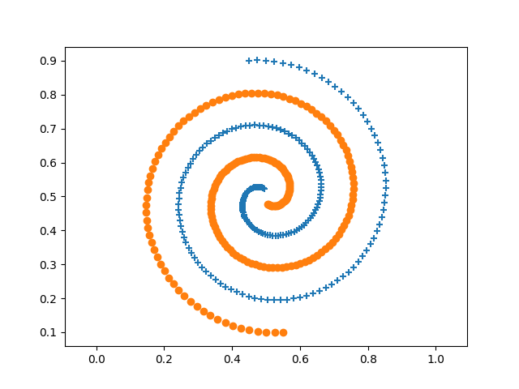
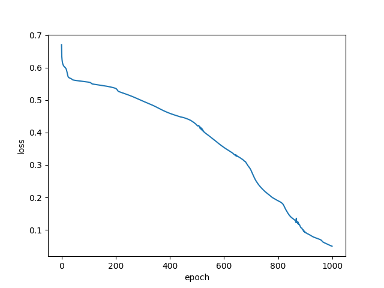
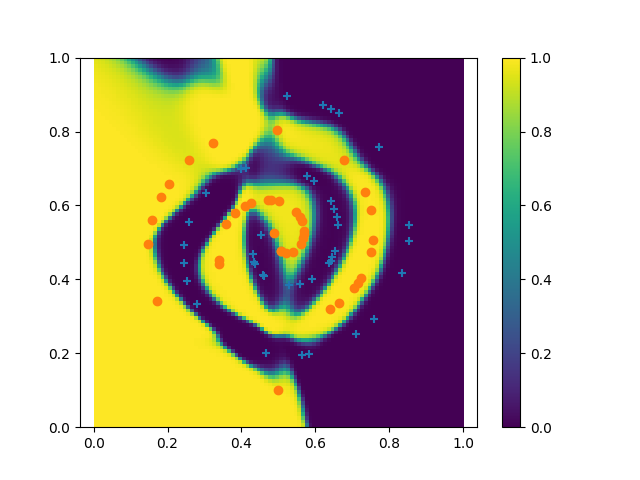
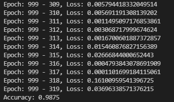

# Neural-networks

---
## `mlp.py`: A multi-layer perceptron implemented by numpy

(Currently the number of hidden layers is fixed to two)

### Example: Two-nested sprials problem

#### Data

#### Loss

#### Prediction result & decision boundary

#### Terminal output

